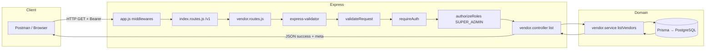
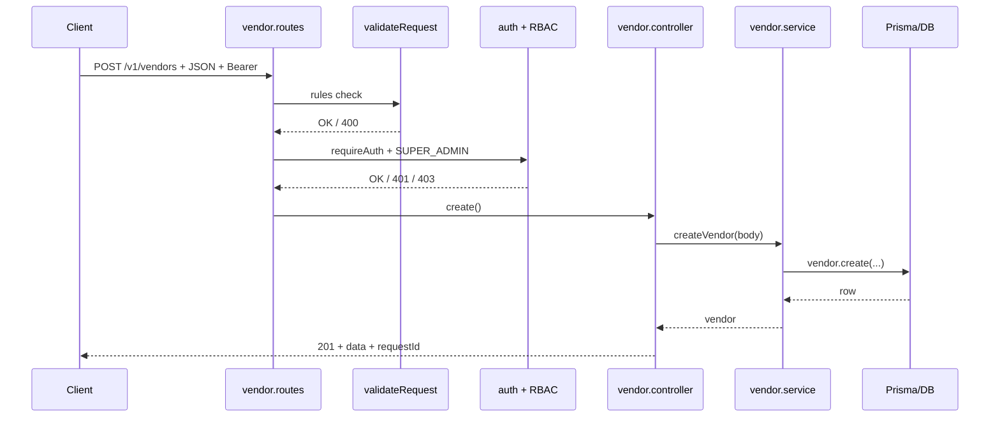
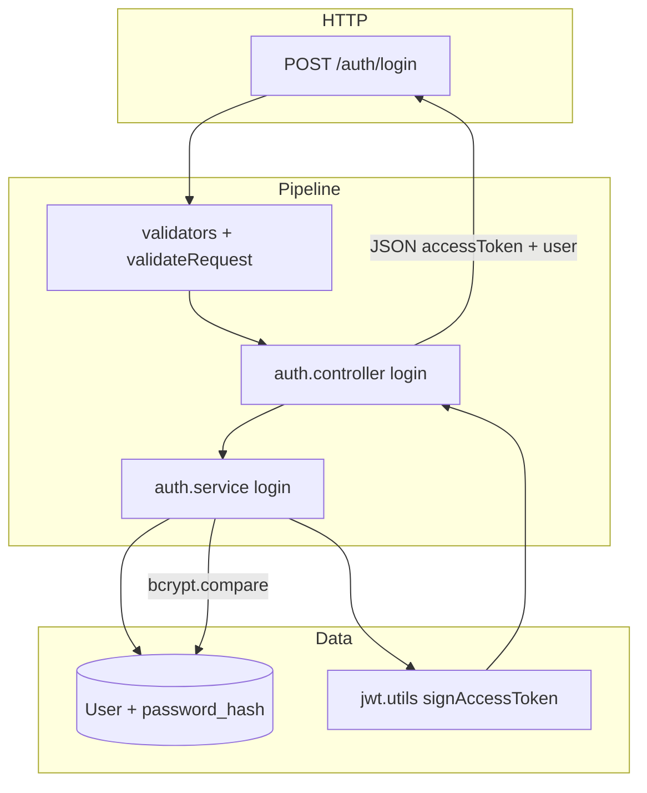

# Request flow (routes → controller → service)

This document explains how HTTP requests move through the backend. Same pattern applies to **Vendor**, **Auth**, and future modules.

## Folder mental map

```text
routes/<domain>/<domain>.routes.js     → URL + middleware chain (auth, validate)
controllers/<domain>/<domain>.controller.js → HTTP response; calls service only
services/<domain>/<domain>.service.js       → Business rules + Prisma / DB
validators/<domain>/<domain>.validators.js  → express-validator field rules

Cross-cutting (stay under services/ root): health, connectivity, shutdown, etc.
Auth bootstrap: services/auth/adminBootstrap.service.js

middlewares/auth.middleware.js → Bearer verify, role check
utils/prisma.utils.js         → DB client singleton
```

## 1) Typical request (example: list vendors)



**One-liner:** Request passes **security + validation** first; the controller only **calls the service**; the service talks to the **database**; the response goes back the same way.

## 2) Create vendor (POST) — sequence



## 3) Login (current — access token only)



**Future (refresh token):** add `Set-Cookie`, a `RefreshToken` (or session) table, and `POST /auth/refresh` — this diagram will gain one more branch.

## Viewing Mermaid diagrams

- GitHub / many IDEs render `.md` Mermaid natively.
- Or paste into [Mermaid Live Editor](https://mermaid.live).
